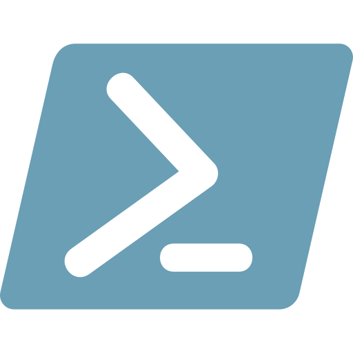
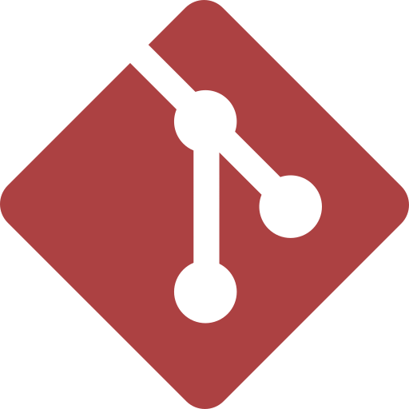
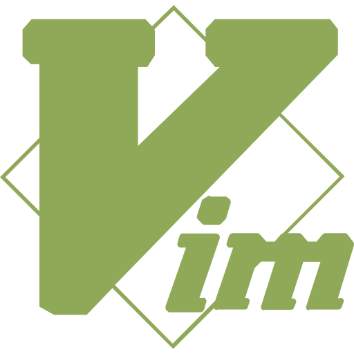
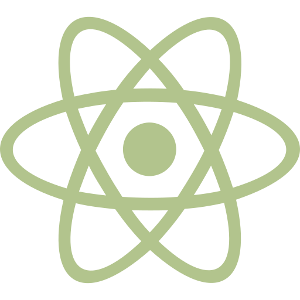
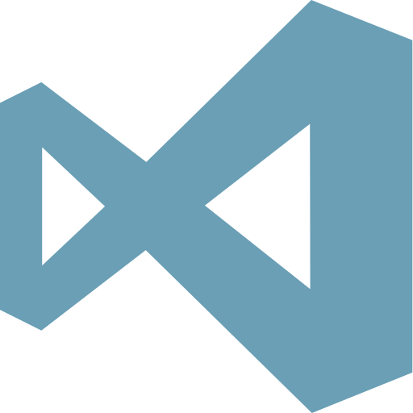

# :checkered_flag: dotfiles for Windows

Programming environment configurations for Windows.


## :package: Package Manager

#### scoop 

  add main and extras buckets:

    ```powershell
    scoop bucket add main
    scoop bucket add extras
    ```


## :computer: Terminal

#### Hyper 


## :shell: Shell

#### Powershell 

  initialize configuration:

    ```powershell
    ~\.scripts\install.ps1
    ```

#### Git bash 


## :pencil2: Text Editor

#### Vim 
#### Atom 
#### Visual Studio Code 


## :pencil: IDE

#### JetBrain
#### Anacoda
#### Visual Studio


## :page_with_curl: Programming Languages

####  node.js
  - TypeScript
####  Python
####  Java
####  C/C++
  - clang
  - gcc


## :paperclip: Miscellaneous

#### Git 
####  Meld
####  Fonts
